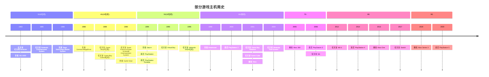

# 游戏模拟器

红白机、掌机，还有小霸王学习机，都是儿时的回忆。 而今自己也早已迈入而立之年，小孩也到了爱玩游戏的年纪，特意搜寻模拟器来回味。

## 模拟器对比

| 模拟器                                                       | 运行平台                                | 索尼主机          | 任天堂主机                                     | 世嘉主机           | 最近更新时间 | 安装包大小 | 协议   | 开发语言                  | 备注                                                       |
|:----------------------------------------------------------|:------------------------------------|:--------------|:------------------------------------------|:---------------|:-------|:------|:-----|:----------------------|:---------------------------------------------------------|
| [RetroArch](https://www.retroarch.com)                    | Windows, Linux, MacOS, Android, iOS | PSX, PSP, PS1 | NES, GB, GBC, SNES, VB, N64, GBA, NDS     | MD, GG, SS, DC | -      | 178M  | GPL  | C, C++                | http://www.libretro.com                                  |
| [OpenEmu](https://openemu.org)                            | MacOS                               | PSX, PSP, PS1 | FC, NES, GB, GBC, SNES, VB, N64, GBA, NDS | MD, GG, SS     | 2024   | 37.7M | ?    | Swift, C, Objective-C |                                                          |
| [Mednafen](https://mednafen.github.io)                    | Windows, Linux                      | PSX, PS1      | NES, GB, GBC, SNES, VB, GBA               | MD, GG, SS     | -      | 6.8M  | GPL  | C++                   |                                                          |
| [BizHawk](https://github.com/TASEmulators/BizHawk)        | Windows, *Linux*, MacOS             | PSX           | NES, GB, GBC, SNES, N64, VB, GBA          | SMS, MD, GG, SS| -      | 62.5M | MIT  | C#, C++, C            | http://tasvideos.org/BizHawk.html                        |
| [higan](https://github.com/higan-emu/higan)               | Windows                             | -             | NES, GB, GBC, SNES, GBA                   | MD, GG         | 2024   | 3.8M  | GPL  | GLSL, C++             |                                                          |
| [Mesen](https://www.mesen.ca)                             | Windows, Linux                      | -             | NES, GB, GBC, SNES, GBA                   | SMS, GG        | -      | 28.7M | GPL  | C++, C#, C            | https://sourceforge.net/projects/mesen.mirror            |
| [Kega Fusion](https://kega-fusion.com)                    | Windows, Linux, MacOS               | -             | -                                         | SMS, MD, GG    | -      | 5.6M  | ?    |  ?                    | https://github.com/javiermisol/Kega-Fusion               |
| [Cemu](https://cemu.info/index.html)                      | Windows, Linux, MacOS               | -             | Wii U                                     | -              | -      | 25M   | MPL  | C++, C                | https://github.com/cemu-project/Cemu                     |
| [RPCS3](https://rpcs3.net)                                | Windows, Linux                      | PS 3          | -                                         | -              | -      | 28.2M | GPL  | C++, C                |                                                          |
| [PCSX2](https://pcsx2.net)                                | Windows, Linux, MacOS               | PS 2          | -                                         | -              | -      | 42.7M | GPL  | C++, C                | https://sourceforge.net/projects/pcsx2                   |
| [NO$GBA](https://www.nogba.com)                           | Windows                             | -             | GBA, NDS                                  | -              | ?      | 0.2M  | ?    | ?                     |                                                          |
| [DeSmuME](https://desmume.org)                            | Windows, MacOS                      | -             | NDS                                       | -              | 2022   | 5.8M  | GPL  | C, C++                | https://github.com/TASEmulators/desmume                  |
| [GB Enhanced+](https://github.com/shonumi/gbe-plus)       | Windows                             | -             | GB, GBC, GBA                              | -              | -      | 22.6M | GPL  | C++, HTML, GLSL       |                                                          |
| [Dolphin](https://dolphin-emu.org)                        | Windows, Linux, MacOS, Android      | -             | GC, Wii                                   | -              | -      | 16.0M | GPL  | C++, Kotlin, C        | https://github.com/dolphin-emu/dolphin                   |
| ~~[GameBoid](https://sourceforge.net/projects/gameboid)~~ | Android                             | -             | GBA                                       | -              | 2015   | 0.8M  | GPL  | Java                  |                                                          |
| [mGBA](https://mgba.io)                                   | Windows, MacOS                      | -             | GBA                                       | -              | -      | 15.5M | MPL  | C, C++                | https://github.com/mgba-emu/mgba                         |
| [VBA-M](https://www.visualboyadvance-m.org)               | MacOS                               | -             | GBA                                       |                | -      | 15.5M | ?    | C++, C                | https://github.com/visualboyadvance-m/visualboyadvance-m |
| [REDREAM](https://redream.io)                             | Windows, Linux, MacOS, Android      | -             | -                                         | DC             | 2019   | 2.8M  | ?    | ?                     |                                                          |
| ~~[reicast](https://github.com/skmp/reicast-emulator)~~   | Android                             | -             | -                                         | DC             | 2020   | 3.7M  | LGPL | C++, C                | https://reicast.emudev.org                               |
| ~~[Dreamemu](http://www.dreamemu.net)~~                   | Windows                             | -             | -                                         | DC             | 2023   | 0.2M  | ?    | C, C++                | https://github.com/bramtechs/dream-emu                   |
| [Project64](https://www.pj64-emu.com)                     | Windows                             | -             | N64                                       | -              | -      | 4.2M  | GPL  | C++                   | https://github.com/project64/project64                   |
| [Mupen64Plus]( https://mupen64plus.org)                   | Windows, Linux, MacOS               | -             | N64                                       | -              | -      | 2.6M  | ?    | C, C++                | https://github.com/mupen64plus                           |
| [sixtyforce](https://sixtyforce.com)                      | MacOS                               | -             | N64                                       | -              | 2021   | 7.7M  | ?    | ?                     |                                                          |
| [ePSXe](https://epsxe.com)                                | Windows, Linux                      | PSX, PS1      | -                                         | -              | 2016   | 1.3M  | ?    | ?                     |                                                          |
| [PPSSPP](https://www.ppsspp.org)                          | Windows, Android                    | PSP           | -                                         | -              | -      | 21.4M | GPL  | C++, C                | https://github.com/hrydgard/ppsspp                       |
| [Jpcsp](https://github.com/jpcsp/jpcsp)                   | Windows, Linux, MacOS               | PSP           | -                                         | -              | -      | 28.9M | GPL  | Java                  |                                                          |
| [Yabause](https://yabause.org)                            | Windows, Linux, MacOS               | -             | -                                         | SS             | 2016   | 6.4M  | GPL  | C, C++                | https://sourceforge.net/projects/yabause                 |
| [Snes9x](https://www.snes9x.com)                          | Windows, MacOS                      | -             | SNES                                      | -              | -      | 4.3M  | ?    | C++, C, Objective-C   | https://github.com/snes9xgit/snes9x                      |
| [ZSNES](https://zsnes.com)                                | Windows, Linux                      | -             | SNES                                      | -              | 2007   | 0.9M  | GPL  | C++, C, Assembly      | https://sourceforge.net/projects/zsnes                   |
| [bsnes](https://github.com/bsnes-emu/bsnes)               | Windows, MacOS                      | -             | SNES                                      | -              | 2020   | 4.2M  | MIT  | C++, C, Objective-C   | https://sourceforge.net/projects/bsnes.mirror            |
| [BGB](https://bgb.bircd.org)                              | Windows                             | -             | GB, GBC                                   | -              | -      | 1M    | ?    | ?                     |                                                          |
| ~~[GBCoid](https://github.com/emanuele-f/gbcoid)~~        | Android                             | -             | GBC                                       | -              | 2012   | 0.2M  | GPL  | java                  | https://sourceforge.net/projects/gbcoid                  |
| [Gens](http://gens.me)                                    | Windows                             | -             | -                                         | MD             | 2008   | 0.6M  | GPL  | C++, Assembly         | https://sourceforge.net/projects/gens                    |
| [Nestopia](https://nestopia.sourceforge.net)              | Windows, MacOS                      | -             | FC, NES                                   | -              | 2008   | 1.2M  | GPL  | C++, C                | https://github.com/0ldsk00l/nestopia                     |
| [VirtualNES](https://github.com/TBirdSoars/VirtuaNES)     | Windows                             | -             | NES                                       | -              | 2019   | 1.1M  | ?    | C, Assembly, C++      |                                                          |
| [FCEUX](https://fceux.com/web/home.html)                  | Windows                             | -             | FC, NES                                   | -              | 2023   | 4.5M  | GPL  | C++, HTML, C, Lua     | https://github.com/TASVideos/fceux                       |
| [Nesoid](https://www.nesoid.com)                          | Android                             | -             | NES                                       | -              | 2012   | 1.1M  | GPL  | C, Java               | https://github.com/proninyaroslav/nesoid                 |
| [Jnes](http://www.jabosoft.com/categories/jnes)           | Windows                             | -             | NES                                       | -              | 2017   | 0.5M  | ?    | ?                     |                                                          |

全能模拟器首推RetroArch，其Windows版本依赖MinGW，模拟器核心可自动下载，不同模拟器核心依赖不同的开源实现。
如NES依赖Nestopia或Mesen等、SNES依赖bsnes或snes9x等、N64依赖Mupen64Plus等、GBA依赖mGBA或VBA-M等、NDS依赖DeSmuME等，Wii依赖Dolphin等；
Genesis依赖FBNeo等、Saturn依赖Yabause等； PSP依赖PPSSPP等。

如果是Mac系统，也可以考虑OpenEmu。

而Mednafen适合定制，不适合一般玩家上手玩。它使用了Higan的libco，其Windows版本依赖MinGW，需命令行启动：mednafen -force_module nes Contra (USA).nes。
对于Windows系统，因路径含有":"，最好将mednafen.cfg的filesys.untrusted_fip_check设置为0。
Mednafen在模拟Sega Saturn时需要名为sega_101.bin额外的[BIOS](https://github.com/archtaurus/RetroPieBIOS) 放到firmware目录下。

与RetroArch类似，BizHawk的模拟器内核也依赖或移植其他开源项目，如NES依赖NESHawk、SNES依赖BSNES、NDS依赖melonDS、N64依赖Mupen64Plus、GBA依赖mGBA、GB和GBC依赖Gambatte，SMS依赖SMSHawk、MD依赖Genplus-gx、SS依赖Saturnus，PSX依赖NymasHock。
每个模拟器可能有多个核心，可以在核心间进行切换。但在实际运行过程中有些无法打开，有些无法操作，且CPU占用率较高。

*Higan需先使用icarus制作rom，然后创建模拟器并加载rom，但rom可能加载失败。*

*Mesen需要下载额外的BIOS才能模拟GBA，其Windows版本依赖.NET框架，CPU使用率和内存使用率较Mednafen高。*

*Kega Fusion 运行时CPU使用率较高*

*在使用ePSXe的2.05版本如果发生crash，则可以尝试将CPU超频设置成x1来解决。*

*Yabause使用Qt框架，加载BIN/CUE可能Crash，运行时CPU占用率非常高*

任天堂GC推荐Dolphin，它支持中文。

任天堂NDS推荐NO$GBA，它不支持中文，也不支持录制。DeSmuME可以直接打开压缩包，不支持中文，且CPU占用率较高。

*任天堂GBA推荐mGBA，它界面支持中文、能够连接到Dolphin。此外，VBA-M 也是一个不错的选择。GB Enhanced+使用Qt技术来支持跨平台，不支持中文，运行时CPU占用率较高；NO$GBA可能无法打开某些游戏，游戏过程中出现Crash。*

世嘉Dreamcast推荐REDREAM，官方网站描述支持GDI、BIN/CUE、CHD或CDI镜像，实际（1.5.0版本）无法识别BIN/CUE。而Dreamemu无法加载某些GDI/BIN。

任天堂N64推荐Project64，它支持繁体中文，退出时有出现Crash。而Mupen64Plus的Windows 2.5.9版本依赖msvcr120.dll，较新版本Windows即便复制本机dll过去仍可能无法启动！

*任天堂SNES推荐Snes9x和bsnes，它们都不支持中文，Snes9x音效依赖DirectX9（高版本Windows为更高版本DirectX）。ZSNES界面太旧，字体显示不佳，鼠标操作飘。*

*世嘉Genesis、Game Gear模拟器有FBAlpha，它使用MinGW来支持Windows系统，但未提供下载地址，可以使用Gens，虽然它无法切换中文，且自定义快捷键也未能生效。*

*任天堂NES模拟器推荐Nestopia。VirtualNES下载的程序无法直接运行；FCEUX使用Lua虚拟机，不支持中文；Nesoid仅支持Android；Jnes显示模糊、键盘鼠标未能操作。*

参考：

1. [RETRO](https://www.retrostic.com/emulators)
2. [Console Roms](https://www.consoleroms.com/)
3. [Game DB](https://indienova.com/gamedb)
4. [emulator zone](https://www.emulator-zone.com/)
