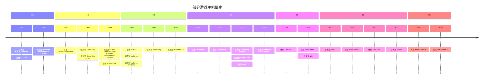

# 游戏模拟器

红白机、掌机，还有小霸王学习机，都是儿时的回忆。 而今自己也早已迈入而立之年，小孩也到了爱玩游戏的年纪，特意搜寻模拟器来回味。

## 按游戏主机分类

| 模拟器名称                    | 索尼            | 任天堂                                                | 世嘉                                    |
|:-------------------------|:--------------|:---------------------------------------------------|:--------------------------------------|
| RetroArch                | PSX, PSP, PS1 | NES, GB, GBC, SNES, Virtual Boy, N64, GBA, NDS     | Genesis, Game Gear, Saturn, Dreamcast |
| OpenEmu                  | PSX, PSP, PS1 | FC, NES, GB, GBC, SNES, Virtual Boy, N64, GBA, NDS | Genesis, Game Gear, Saturn            |
| Mednafen                 | PSX, PS1      | NES, GB, GBC, SNES, Virtual Boy, GBA               | Genesis, Game Gear, Saturn            |
| higan                    | N             | NES, GB, GBC, SNES, GBA                            | Genesis, Game Gear                    |
| WhineCube                | N             | GC, Wii                                            | N                                     |
| Mesen-S                  | N             | NES, GB, GBC, SNES                                 | N                                     |
| RPCS3                    | PS 3          | N                                                  | N                                     |
| PCSX2                    | PS 2          | N                                                  | N                                     |
| NO$GBA                   | N             | GBA, NDS                                           | N                                     |
| Pretendo                 | N             | N64, NDS                                           | N                                     |
| DraStic                  | N             | NDS                                                | N                                     |
| DeSmuME                  | N             | NDS                                                | N                                     |
| NDS Emulator for Android | N             | NDS                                                | N                                     |
| iDeaS                    | N             | NDS                                                | N                                     |
| AseDS                    | N             | NDS                                                | N                                     |
| GB Enhanced+             | N             | GB, GBC, GBA                                       | N                                     |
| Dolphin                  | N             | GC                                                 | N                                     |
| Gcube                    | N             | GC                                                 | N                                     |
| GameBoid                 | N             | GBA                                                | N                                     |
| John GBA                 | N             | GBA                                                | N                                     |
| mGBA                     | N             | GBA                                                | N                                     |
| Boycott Advance          | N             | GBA                                                | N                                     |
| VBA-M                    | N             | GBA                                                | N                                     |
| DEmul                    | N             | N                                                  | Dreamcast                             |
| nullDC                   | N             | N                                                  | Dreamcast                             |
| Redream                  | N             | N                                                  | Dreamcast                             |
| Reicast                  | N             | N                                                  | Dreamcast                             |
| Chankast                 | N             | N                                                  | Dreamcast                             |
| Dreamemu                 | N             | N                                                  | Dreamcast                             |
| Project64                | N             | N64                                                | N                                     |
| MegaN64                  | N             | N64                                                | N                                     |
| Mupen64Plus              | N             | N64                                                | N                                     |
| Mupen64Plus FZ           | N             | N64                                                | N                                     |
| 1964                     | N             | N64                                                | N                                     |
| SuperN64                 | N             | N64                                                | N                                     |
| M64                      | N             | N64                                                | N                                     |
| sixtyforce               | N             | N64                                                | N                                     |
| Tendo64                  | N             | N64                                                | N                                     |
| ClassicBoy               | N             | N64                                                | N                                     |
| FPSe                     | PSX, PS1      | N                                                  | N                                     |
| ePSXe                    | PSX, PS1      | N                                                  | N                                     |
| Pcsx                     | PSX, PS1      | N                                                  | N                                     |
| PSX4Droid                | PSX, PS1      | N                                                  | N                                     |
| PSXeven                  | PSX, PS1      | N                                                  | N                                     |
| VGS XP                   | PSX, PS1      | N                                                  | N                                     |
| pSX                      | PSX, PS1      | N                                                  | N                                     |
| PPSSPP                   | PSP           | N                                                  | N                                     |
| JPCSP                    | PSP           | N                                                  | N                                     |
| Yabuse                   | N             | N                                                  | Saturn                                |
| SSF                      | N             | N                                                  | Saturn                                |
| Snes9x                   | N             | SNES                                               | N                                     |
| ZSNES                    | N             | SNES                                               | N                                     |
| SnesGT                   | N             | SNES                                               | N                                     |
| BSNES                    | N             | SNES                                               | N                                     |
| My OldBoy!               | N             | GB, GBC                                            | N                                     |
| BGB                      | N             | GB, GBC                                            | N                                     |
| TGB Dual                 | N             | GBC                                                | N                                     |
| GBCoid                   | N             | GBC                                                | N                                     |
| FB Alpha                 | N             | N                                                  | Genesis, Game Gear                    |
| Kega Fusion              | N             | N                                                  | Genesis, Game Gear                    |
| regen                    | N             | N                                                  | Genesis, Game Gear                    |
| Gens                     | N             | N                                                  | Genesis                               |
| Gensoid                  | N             | N                                                  | Genesis                               |
| Nestopia                 | N             | FC, NES                                            | N                                     |
| FCEUX                    | N             | FC, NES                                            | N                                     |
| VirtualNES               | N             | NES                                                | N                                     |
| Nesoid                   | N             | NES                                                | N                                     |
| Jnes                     | N             | NES                                                | N                                     |
| Nostalgia.NES            | N             | NES                                                | N                                     |
| My Nes                   | N             | NES                                                | N                                     |
| Uber Nes                 | N             | NES                                                | N                                     |
| Rock Nes                 | N             | NES                                                | N                                     |

## 按模拟器运行平台分类

| 模拟器名称                    | Windows | Linux | MacOS | Android | iOS |
|:-------------------------|:--------|:------|:------|:--------|:----|
| RetroArch                | Y       | Y     | Y     | Y       | Y   |
| OpenEmu                  | N       | N     | Y     | N       | N   |
| Mednafen                 | Y       | Y     | N     | N       | N   |
| higan                    | Y       | N     | N     | N       | N   |
| FPSe                     | N       | N     | N     | Y       | N   |
| ePSXe                    | Y       | Y     | N     | N       | N   |
| Pcsx                     | Y       | Y     | Y     | N       | N   |
| PSX4Droid                | N       | N     | N     | Y       | N   |
| PSXeven                  | Y       | N     | N     | N       | N   |
| VGS XP                   | Y       | N     | N     | N       | N   |
| pSX                      | Y       | N     | N     | N       | N   |
| DraStic                  | N       | N     | N     | Y       | N   |
| DeSmuME                  | Y       | N     | Y     | N       | N   |
| NDS Emulator for Android | N       | N     | N     | Y       | N   |
| NO$GBA                   | Y       | N     | N     | N       | N   |
| iDeaS                    | Y       | Y     | N     | N       | N   |
| Pretendo                 | N       | N     | N     | Y       | N   |
| AseDS                    | N       | N     | N     | Y       | N   |
| Snes9x                   | Y       | N     | Y     | N       | N   |
| ZSNES                    | Y       | Y     | N     | N       | N   |
| SnesGT                   | Y       | Y     | N     | N       | N   |
| BSNES                    | Y       | N     | Y     | N       | N   |
| Mesen-S                  | Y       | Y     | N     | N       | N   |
| FB Alpha                 | Y       | N     | N     | N       | N   |
| Gens                     | Y       | N     | N     | N       | N   |
| Kega Fusion              | Y       | N     | Y     | N       | N   |
| Gensoid                  | N       | N     | N     | Y       | N   |
| regen                    | Y       | N     | N     | N       | N   |
| VirtualNES               | Y       | N     | N     | N       | N   |
| Nesoid                   | N       | N     | N     | Y       | N   |
| Jnes                     | Y       | N     | N     | N       | N   |
| FCEUX                    | Y       | N     | N     | N       | N   |
| Nestopia                 | Y       | N     | Y     | N       | N   |
| Nostalgia.NES            | N       | N     | N     | Y       | N   |
| My Nes                   | Y       | N     | N     | N       | N   |
| Uber Nes                 | Y       | N     | N     | N       | N   |
| Rock Nes                 | N       | Y     | Y     | N       | N   |
| Project64                | Y       | N     | N     | N       | N   |
| MegaN64                  | N       | N     | N     | Y       | N   |
| Mupen64Plus              | Y       | Y     | Y     | N       | N   |
| Mupen64Plus FZ           | N       | N     | N     | Y       | N   |
| 1964                     | Y       | N     | N     | N       | N   |
| SuperN64                 | N       | N     | N     | Y       | N   |
| M64                      | N       | N     | N     | Y       | N   |
| sixtyforce               | N       | N     | Y     | N       | N   |
| Tendo64                  | N       | N     | N     | Y       | N   |
| ClassicBoy               | N       | N     | N     | Y       | N   |
| GameBoid                 | N       | N     | N     | Y       | N   |
| John GBA                 | N       | N     | N     | Y       | N   |
| mGBA                     | Y       | N     | Y     | N       | N   |
| GB Enhanced+             | Y       | N     | N     | N       | N   |
| Boycott Advance          | N       | N     | Y     | N       | N   |
| VBA-M                    | N       | N     | Y     | N       | N   |
| My OldBoy!               | N       | N     | N     | Y       | N   |
| BGB                      | Y       | N     | N     | N       | N   |
| TGB Dual                 | Y       | N     | N     | N       | N   |
| GBCoid                   | N       | N     | N     | Y       | N   |
| Yabuse                   | Y       | Y     | Y     | N       | N   |
| SSF                      | Y       | N     | N     | N       | N   |
| PPSSPP                   | Y       | N     | N     | Y       | N   |
| JPCSP                    | Y       | Y     | Y     | N       | N   |
| Dolphin                  | Y       | Y     | Y     | Y       | N   |
| Gcube                    | Y       | Y     | Y     | N       | N   |
| WhineCube                | Y       | N     | N     | N       | N   |
| PCSX2                    | Y       | Y     | Y     | N       | N   |
| RPCS3                    | Y       | Y     | N     | N       | N   |
| DEmul                    | Y       | N     | N     | N       | N   |
| nullDC                   | Y       | Y     | N     | N       | N   |
| Redream                  | Y       | Y     | Y     | Y       | N   |
| Reicast                  | N       | N     | N     | Y       | N   |
| Chankast                 | Y       | N     | N     | N       | N   |
| Dreamemu                 | Y       | N     | N     | N       | N   |

## 模拟器对比

| 模拟器           | 网址                                         | 最近更新时间 | 安装包大小 | 协议   | 开发语言                  | 备注                                                       |
|:--------------|:-------------------------------------------|:-------|:------|:-----|:----------------------|:---------------------------------------------------------|
| RetroArch     | https://www.retroarch.com                  | -      | 178M  | GPL  | C, C++                | http://www.libretro.com                                  |
| OpenEmu       | https://openemu.org                        | 2024   | 37.7M | ?    | Swift, C, Objective-C |                                                          |
| Mednafen      | https://mednafen.github.io                 | -      | 6.8M  | GPL  | C++                   |                                                          |
| higan         | https://github.com/higan-emu/higan         | 2024   | 3.8M  | GPL  | GLSL, C++             |                                                          |
| Mesen         | https://www.mesen.ca                       | -      | 28.7M | GPL  | C++, C#, C            |                                                          |
| RPCS3         | https://rpcs3.net                          | -      | 28.2M | GPL  | C++, C                |                                                          |
| PCSX2         | https://pcsx2.net                          | -      | 42.7M | GPL  | C++, C                | https://sourceforge.net/projects/pcsx2                   |
| NO$GBA        | https://www.nogba.com                      | ?      | 0.2M  | ?    | ?                     |                                                          |
| DeSmuME       | https://desmume.org                        | 2022   | 5.8M  | GPL  | C, C++                | https://github.com/TASEmulators/desmume                  |
| GB Enhanced+  | https://github.com/shonumi/gbe-plus        | -      | 22.6M | GPL  | C++, HTML, GLSL       |                                                          |
| Dolphin       | https://dolphin-emu.org                    | -      | 16.0M | GPL  | C++, Kotlin, C        | https://github.com/dolphin-emu/dolphin                   |
| GCUBE         | https://github.com/moras-p/gcube           | 2019   | ?     | GPL  | C                     |                                                          |
| ~~GameBoid~~  | https://sourceforge.net/projects/gameboid  | 2015   | 0.8M  | GPL  | Java                  |                                                          |
| mGBA          | https://mgba.io                            | -      | 15.5M | MPL  | C, C++                | https://github.com/mgba-emu/mgba                         |
| VBA-M         | https://www.visualboyadvance-m.org         | -      | 15.5M | ?    | C++, C                | https://github.com/visualboyadvance-m/visualboyadvance-m |
| Demul         | https://github.com/RDCH106/demul           | 2015   | ?     | ?    | C                     |                                                          |
| ~~nullDC~~    | https://github.com/skmp/nullDC             | 2015   | ?     | ?    | C++, C                | reicast                                                  |
| REDREAM       | https://redream.io                         | 2019   | 2.8M  | ?    | ?                     |                                                          |
| ~~reicast~~   | https://github.com/skmp/reicast-emulator   | 2020   | 3.7M  | LGPL | C++, C                | https://reicast.emudev.org                               |
| ~~Dreamemu~~  | http://www.dreamemu.net                    | 2023   | 0.2M  | ?    | C, C++                | https://github.com/bramtechs/dream-emu                   |
| Project64     | https://www.pj64-emu.com                   | -      | 4.2M  | GPL  | C++                   | https://github.com/project64/project64                   |
| MegaN64       | https://github.com/jdbcdev/MegaN64         | 2019   | ?     | GPL  | C, C++, Java          | Mupen64Plus                                              |
| Mupen64Plus   | https://mupen64plus.org                    | -      | 2.6M  | ?    | C, C++                | https://github.com/mupen64plus                           |
| sixtyforce    | https://sixtyforce.com                     | 2021   | 7.7M  | ?    | ?                     |                                                          |
| ePSXe         | https://epsxe.com                          | 2016   | 1.3M  | ?    | ?                     |                                                          |
| ~~psx4droid~~ | https://sourceforge.net/projects/psx4droid | 2012   |       | GPL  | java                  | https://github.com/libretro/pcsx_rearmed                 |
| PPSSPP        | https://www.ppsspp.org                     | -      | 21.4M | GPL  | C++, C                | https://github.com/hrydgard/ppsspp                       |
| Jpcsp         | https://github.com/jpcsp/jpcsp             | -      | 28.9M | GPL  | Java                  |                                                          |
| Yabause       | https://yabause.org                        | 2016   | 6.4M  | GPL  | C, C++                | https://sourceforge.net/projects/yabause                 |
| Snes9x        | https://www.snes9x.com                     | -      | 4.3M  | ?    | C++, C, Objective-C   | https://github.com/snes9xgit/snes9x                      |
| ZSNES         | https://zsnes.com                          | 2007   | 0.9M  | GPL  | C++, C, Assembly      | https://sourceforge.net/projects/zsnes                   |
| bsnes         | https://github.com/bsnes-emu/bsnes         | 2020   | 4.2M  | MIT  | C++, C, Objective-C   | https://sourceforge.net/projects/bsnes.mirror            |
| BGB           | https://bgb.bircd.org                      | -      | 1M    | ?    | ?                     |                                                          |
| ~~GBCoid~~    | https://github.com/emanuele-f/gbcoid       | 2012   | 0.2M  | GPL  | java                  | https://sourceforge.net/projects/gbcoid                  |
| ~~FBAlpha~~   | https://github.com/barry65536/FBAlpha      | 2019   | ?     | ?    | C++, C, Assembly      |                                                          |
| Gens          | http://gens.me                             | 2008   | 0.6M  | GPL  | C++, Assembly         | https://sourceforge.net/projects/gens                    |
| Nestopia      | https://nestopia.sourceforge.net           | 2008   | 1.2M  | GPL  | C++, C                | https://github.com/0ldsk00l/nestopia                     |
| VirtualNES    | https://github.com/TBirdSoars/VirtuaNES    | 2019   | 1.1M  | ?    | C, Assembly, C++      |                                                          |
| FCEUX         | https://fceux.com/web/home.html            | 2023   | 4.5M  | GPL  | C++, HTML, C, Lua     | https://github.com/TASVideos/fceux                       |
| Nesoid        | https://www.nesoid.com                     | 2012   | 1.1M  | GPL  | C, Java               | https://github.com/proninyaroslav/nesoid                 |
| Jnes          | http://www.jabosoft.com/categories/jnes    | 2017   | 0.5M  | ?    | ?                     |                                                          |
| rocknes       | https://github.com/ronaldotd/rocknes       | 2018   | ?     | ?    | Python                |                                                          |

全能模拟器首推RetroArch，其Windows版本依赖MinGW，模拟器核心可自动下载，不同模拟器核心依赖不同的开源实现。
如NES依赖Nestopia或Mesen等、SNES依赖bsnes或snes9x等、N64依赖Mupen64Plus等、GBA依赖mGBA或VBA-M等、NDS依赖DeSmuME等，Wii依赖Dolphin等；
Genesis依赖FBNeo等、Saturn依赖Yabause等； PSP依赖PPSSPP等。

如果是Mac系统，也可以考虑OpenEmu。

而Mednafen适合定制，不适合一般玩家上手玩。它使用了Higan的libco，其Windows版本依赖MinGW，需命令行启动：mednafen -force_module nes Contra (USA).nes。
对于Windows系统，因路径含有":"，最好将mednafen.cfg的filesys.untrusted_fip_check设置为0。
Mednafen在模拟Sega Saturn时需要名为sega_101.bin额外的BIOS放到firmware目录下。

*Higan需先使用icarus制作rom，然后创建模拟器并加载rom，但rom可能加载失败。*

*Mesen的Windows版本依赖.NET框架。*

*Mupen64Plus的Windows 2.5.9版本依赖msvcr120.dll，较新版本Windows即便复制本机dll过去仍可能无法启动*

*在使用ePSXe的2.05版本如果发生crash，则可以尝试将CPU超频设置成x1来解决。*

*Yabuse使用Qt框架，加载BIN/CUE可能Crash。*

任天堂NDS推荐NO$GBA，它不支持中文，也不支持录制。DeSmuME可以直接打开压缩包，不支持中文，且CPU占用率较高。

任天堂GBA推荐mGBA，它界面支持中文、能够连接到Dolphin。此外，VBA-M 也是一个不错的选择。GB Enhanced+使用Qt技术来支持跨平台，不支持中文，运行时CPU占用率较高；NO$GBA可能无法打开某些游戏，游戏过程中出现Crash。

世嘉DC推荐REDREAM，官方网站描述支持GDI、BIN/CUE、CHD或CDI镜像，实际（1.5.0版本）无法识别BIN/CUE。而Dreamemu无法加载某些GDI/BIN。

任天堂N64推荐Project64，它支持繁体中文，退出时有出现Crash。

任天堂SNES推荐Snes9x和bsnes，它们都不支持中文，Snes9x音效依赖DirectX9（高版本Windows为更高版本DirectX）。ZSNES界面太旧，字体显示不佳，鼠标操作飘。

世嘉Genesis、GC模拟器有FBAlpha，它使用MinGW来支持Windows系统，但未提供下载地址，可以使用Gens，虽然它无法切换中文，且自定义快捷键也未能生效。

任天堂NES模拟器推荐Nestopia。VirtualNES下载的程序无法直接运行；FCEUX使用Lua虚拟机，不支持中文；Nesoid仅支持Android；Jnes显示模糊、键盘鼠标未能操作。

参考：

1. [RETRO](https://www.retrostic.com/emulators)
2. [Console Roms](https://www.consoleroms.com/)
3. [Game DB](https://indienova.com/gamedb)
4. [the old computer](https://www.theoldcomputer.com/roms/)
5. [emulator zone](https://www.emulator-zone.com/)
